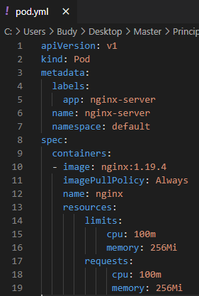
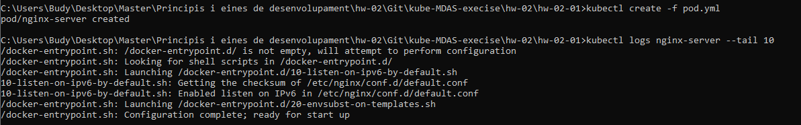
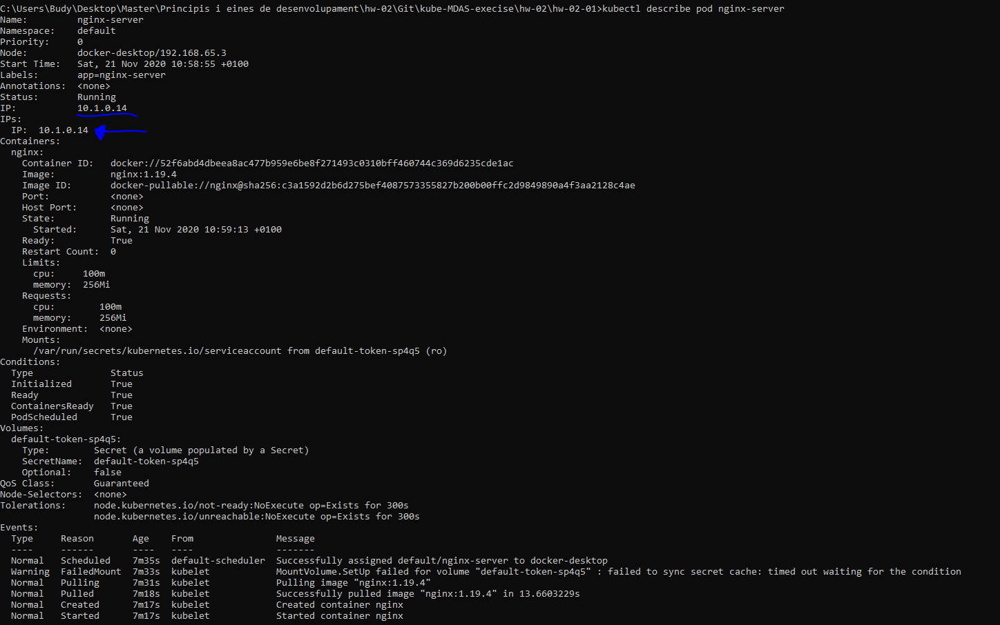
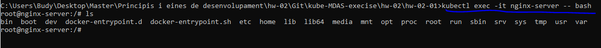
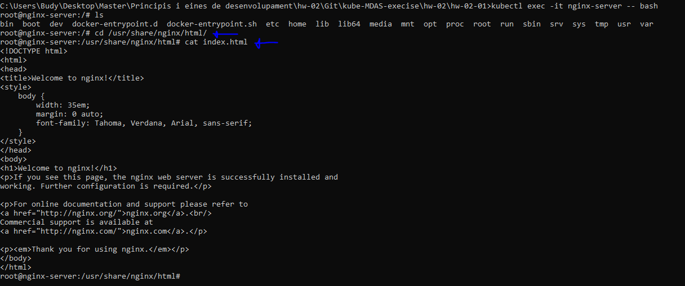
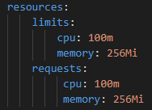

# POD NGINX 📦🌐

## Creacion POD NGINX SERVER:
* Crea un pod de forma declarativa (fichero YML) con las siguientes especificaciones:

>
Imagen: nginx  
Version: 1.19.4  
    Label: app: nginx-server  
    Limits  
CPU: 100 milicores  
Memoria: 256Mi  
    Requests  
CPU: 100 milicores  
Memoria: 256Mi  
>
## Creamos el POD de forma delarativa:

  

## Lo ejecutamos con el siguiente comando:

`` kubectl create -f pod.yml ``

### Pregunta 1 - ¿Cómo puedo obtener las últimas 10 líneas de la salida estándar (logs generados por la aplicación)?
* Utilizando el siguiente comando:  
`` kubectl logs nginx-server --tail 10 ``   
  
  

### Pregunta 2 - ¿Cómo podría obtener la IP interna del pod? Aporta capturas para indicar el proceso que seguirías.

* Utilizando el siguiente comando:   

`` kubectl describe pod nginx-server``   
  
  
### Pregunta 3 - ¿Qué comando utilizarías para entrar dentro del pod?
* Parae entrar dentro del Pod utilizaria:  

``kubectl exec -it nginx-server -- bash``

 
### Pregunta 4 - Necesitas visualizar el contenido que expone NGINX, ¿qué acciones debes llevar a cabo?
* Una vez dentro del pod en Bash acedemos al fichero "index.html" que expone por defecto, se encuentra:

``cd /usr/share/nginx/html``

Luego realizamos "cat" para visualizarlo/editarlo:

`` cat index.html``

### Pregunta 5 - Indica la calidad de servicio (QoS) establecida en el pod que acabas de crear. ¿Qué lo has mirado?
* La calidad del servicio sera Quaranteed, ya que los limites y las request de nuestro Pod son iguales.

