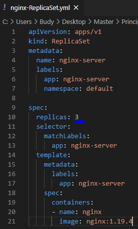
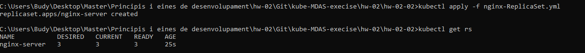
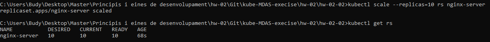

# Replicaset NGINX 📦🌐

## Creacion replicaSet:
* Especificamos de forma declarativa (fichero YML) las 3 replicas:

  

## Lo ejecutamos con el siguiente comando:

`` kubectl apply -f nginx-ReplicaSet.yml ``

  

## Escalar 10 replicas:

`` kubectl scale --replicas=10 rs nginx-server ``

  