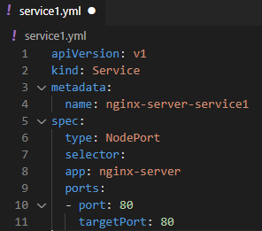
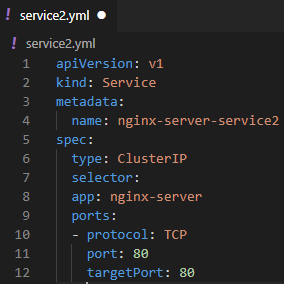
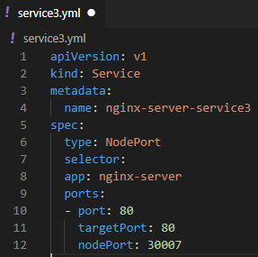
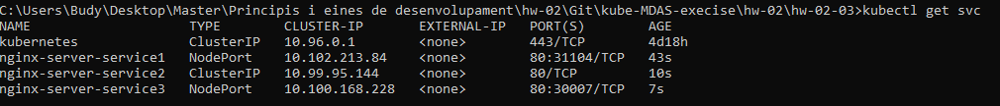

# Services NGINX 📦🌐

## Creacion de 3 services:

### Service1 - Exponiendo servicio hacia el exterior

`` kubectl create -f service1.yml``

  

### Service1 - Exponiendo servicio hacia el exterior

`` kubectl create -f service2.yml``

  

### Service1 - Exponiendo servicio hacia el exterior

`` kubectl create -f service3.yml``

  

## Revisamos todos los servicios creados con el siguiente comando:

`` kubectl get svc``

  

