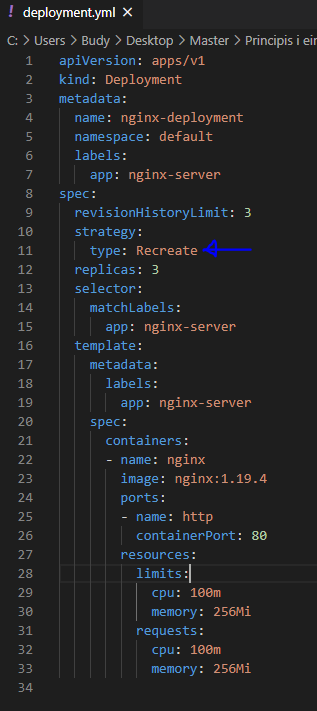
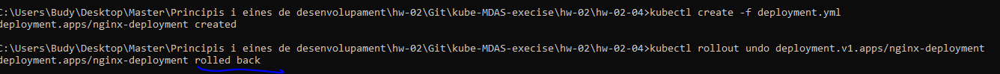

# Deployment - Recreate NGINX 📦🌐

### Despliege de un servicio mediante la técnica "Recreate":

  

`` kubectl create -f deployment.yml``

### Rollout deployment

`` kubectl rollout undo deployment.v1.apps/nginx-deployment``

  

### Rollback a una version previa

Para volver a una version previamente creada le especificamos el numero de la version (Example revision 2):

`` kubectl rollout undo deployment/app --to-revision=2``

